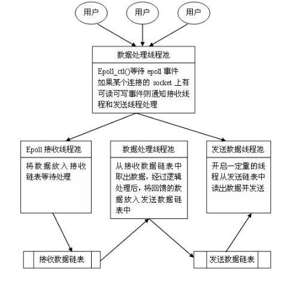

# 彻底学会epoll - Epoll模型详解
## 1. 内核中提高I/O性能的新方法epoll
epolepoll是什么？按照man手册的说法：是为处理大批量句柄而作了改进的poll。要使用epoll只需要这三个系统调 用：epoll_create(2)， epoll_ctl(2)， epoll_wait(2)。当然，这不是2.6内核才有的，它是在 2.5.44内核中被引进的(epoll(4) is a new API introduced in Linux kernel 2.5.44)
### Linux2.6 内核epoll介绍
先介绍2本书《The Linux Networking Architecture--Design and Implementation of Network Protocols in the Linux Kernel》，以2.4内核讲解Linux TCP/IP实现，相当不错.作为一个现实世界中的实现，很多时候你必须作很多权衡，这时候参考一个久经考验的系统更有实际意义。举个例子linux内 核中sk_buff结构为了追求速度和安全，牺牲了部分内存，所以在发送TCP包的时候，无论应用层数据多大,sk_buff最小也有272的字节.其实对于socket应用层程序来说，另外一本书《UNIX Network Programming Volume 1》意义更大一点.2003年的时候，这本书出了最新的第3版本，不过主要还是修订第2版本。其中第6章《I/O Multiplexing》是最重要的。Stevens给出了网络IO的基本模型。在这里最重要的莫过于select模型和Asynchronous I/O模型.从理论上说，AIO（异步I/O）似乎是最高效的，你的IO操作可以立即返回，然后等待os告诉你IO操作完成。但是一直以来，如何实现就没有一个完美的方案。最著名的windows完成端口实现的AIO,实际上也是内部用线程池实现的罢了，最后的结果是IO有个线程池，你应用也需要一个线程池...... 很多文档其实已经指出了这带来的线程context-switch带来的代价。在linux 平台上，关于网络AIO一直是改动最多的地方，2.4的年代就有很多AIO内核patch,最著名的应该算是SGI那个。但是一直到2.6内核发布，网络模块的AIO一直没有进入稳定内核版本(大部分都是使用用户线程模拟方法，在使用了NPTL的linux上面其实和windows的完成端口基本上差不多了)。2.6内核所支持的AIO特指磁盘的AIO---支持io_submit(),io_getevents()以及对Direct IO的支持(就是绕过VFS系统buffer直接写硬盘，对于流服务器在内存平稳性上有相当帮助)。所以，剩下的select模型基本上就是我们在linux上面的唯一选择，其实，如果加上no-block socket的配置，可以完成一个"伪"AIO的实现，只不过推动力在于你而不是os而已。不过传统的select/poll函数有着一些无法忍受的缺点，所以改进一直是2.4-2.5开发版本内核的任务，包括/dev/poll，realtime signal等等。最终，Davide Libenzi开发的epoll进入2.6内核成为正式的解决方案
## 2. selected 缺陷
首先，在Linux内核中，select所用到的FD_SET是有限的，即内核中有个参数__FD_SETSIZE定义了每个FD_SET的句柄个数，在我用的2.6.15-25-386内核中，该值是1024，搜索内核源代码得到：
```C
include/linux/posix_types.h
#define __FD_SETSIZE         1024
```
也就是说，如果想要同时检测1025个句柄的可读状态是不可能用select实现的。或者同时检测1025个句柄的可写状态也是不可能的。其次，内核中实现 select是用轮询方法，即每次检测都会遍历所有FD_SET中的句柄，显然，select函数执行时间与FD_SET中的句柄个数有一个比例关系，即 select要检测的句柄数越多就会越费时。当然，在前文中我并没有提及poll方法，事实上用select的朋友一定也试过poll，我个人觉得 select和poll大同小异，个人偏好于用select而已。

## 3. epoll的优点
### 3.1 支持一个进程打开大数目的socket描述符(FD)
select 最不能忍受的是一个进程所打开的FD是有一定限制的，由FD_SETSIZE设置，默认值是2048。对于那些需要支持的上万连接数目的IM服务器来说显然太少了。这时候你一是可以选择修改这个宏然后重新编译内核，不过资料也同时指出这样会带来网络效率的下降，二是可以选择多进程的解决方案(传统的 Apache方案)，不过虽然linux上面创建进程的代价比较小，但仍旧是不可忽视的，加上进程间数据同步远比不上线程间同步的高效，所以也不是一种完美的方案。不过epoll则没有这个限制，它所支持的FD上限是最大可以打开文件的数目，这个数字一般远大于2048,举个例子,在1GB内存的机器上大约是10万左 右，具体数目可以cat /proc/sys/fs/file-max察看,一般来说这个数目和系统内存关系很大。
```
cat /proc/sys/fs/file-max
结果：97553
```
### 3.2 IO效率不随FD数目增加而线性下降
传统的select/poll另一个致命弱点就是当你拥有一个很大的socket集合，不过由于网络延时，任一时间只有部分的socket是"活跃"的，但是select/poll每次调用都会线性扫描全部的集合，导致效率呈现线性下降。但是epoll不存在这个问题，它只会对"活跃"的socket进行操作---这是因为在内核实现中epoll是根据每个fd上面的callback函数实现的。那么，只有"活跃"的socket才会主动的去调用callback函数，其他idle状态socket则不会，在这点上，epoll实现了一个"伪"AIO，因为这时候推动力在os内核。在一些benchmark中，如果所有的socket基本上都是活跃的---比如一个高速LAN环境，epoll并不比select/poll有什么效率，相反，如果过多使用epoll_ctl,效率相比还有稍微的下降。但是一旦使用idle connections模拟WAN环境,epoll的效率就远在select/poll之上了。
### 3.3 使用mmap加速内核与用户空间的消息传递。
这点实际上涉及到epoll的具体实现了。无论是select,poll还是epoll都需要内核把FD消息通知给用户空间，如何避免不必要的内存拷贝就很重要，在这点上，epoll是通过内核与用户空间mmap同一块内存实现的。而如果你想我一样从2.5内核就关注epoll的话，一定不会忘记手工mmap这一步的。
## 3.4 内核微调
这一点其实不算epoll的优点了，而是整个linux平台的优点。也许你可以怀疑linux平台，但是你无法回避linux平台赋予你微调内核的能力。比如，内核TCP/IP协议栈使用内存池管理sk_buff结构，那么可以在运行时期动态调整这个内存pool(skb_head_pool)的大小--- 通过echo XXXX>/proc/sys/net/core/hot_list_length完成。再比如listen函数的第2个参数(TCP完成3次握手的数据包队列长度)，也可以根据你平台内存大小动态调整。更甚至在一个数据包面数目巨大但同时每个数据包本身大小却很小的特殊系统上尝试最新的NAPI网卡驱动架构。
## 4. epoll的工作模式
令人高兴的是，2.6内核的epoll比其2.5开发版本的/dev/epoll简洁了许多，所以，大部分情况下，强大的东西往往是简单的。唯一有点麻烦是epoll有2种工作方式:LT和ET。
### LT
LT(level-triggered)是缺省的工作方式：并且同时支持block和no-block socket.在这种做法中，内核告诉你一个文件描述符是否就绪了，然后你可以对这个就绪的fd进行IO操作。如果你不作任何操作，内核还是会继续通知你的，所以，这种模式编程出错误可能性要小一点。传统的select/poll都是这种模型的代表．
### ET
ET(edge-triggered)是高速工作方式：只支持no-block socket。在这种模式下，当描述符从未就绪变为就绪时，内核通过epoll告诉你。然后它会假设你知道文件描述符已经就绪，并且不会再为那个文件描述符发送更多的就绪通知，直到你做了某些操作导致那个文件描述符不再为就绪状态了(比如，你在发送，接收或者接收请求，或者发送接收的数据少于一定量时导致了一个EWOULDBLOCK错误）。但是请注意，如果一直不对这个fd作IO操作(从而导致它再次变成未就绪)，内核不会发送更多的通知(only once)。)

---

epoll只有epoll_create,epoll_ctl,epoll_wait 3个系统调用，具体用法请参考http://www.xmailserver.org/linux-patches/nio-improve.html ，在http://www.kegel.com/rn/也有一个完整的例子，大家一看就知道如何使用了Leader/follower模式线程 pool实现，以及和epoll的配合。

## 5. epoll的使用方法
> 接口非常简单，一共就三个函数
### 头文件
```
#include <sys/epoll.h>
```

### 5.1 创建
```
    int epoll_create(int size);
```
- epoll_create() creates an epoll(7) instance.  Since Linux 2.6.8, the size argument is ignored, but must be greater than zero; see NOTES below.
- 创建一个epoll的句柄，size用来告诉内核这个监听的数目一共有多大。这个参数不同于select()中的第一个参数，给出最大监听的fd+1的值。需要注意的是，当创建好epoll句柄后，它就是会占用一个fd值，在linux下如果查看/proc/进程id/fd/，是能够看到这个fd的，所以在使用完epoll后，必须调用close()关闭，否则可能导致fd被耗尽。
- 返回 epoll_create()  returns a file descriptor referring to the new epoll instance.This file descriptor is used for all the subsequent calls to the epoll interface.  When no longer
required,the file descriptor returned by epoll_create() should be closed by using close(2).  When all file descriptors referring to an epoll instance have been closed, the kernel destroys the instance and releases the associated resources for reuse.

### 5.2 控制
```
    int epoll_ctl(int epfd, int op, int fd, struct epoll_event *event);
```
epoll的事件注册函数，它不同与select()是在监听事件时（epoll使用epoll_wait监听）告诉内核要监听什么类型的事件，而是在这里先注册要监听的事件类型。
- 第一个参数是epoll_create()的返回值
- 第二个参数表示动作，用三个宏来表示： 
    - EPOLL_CTL_ADD：注册新的fd到epfd中；
    - EPOLL_CTL_MOD：修改已经注册的fd的监听事件；
    - EPOLL_CTL_DEL：从epfd中删除一个fd；
- 第三个参数是需要监听的fd
- 第四个参数是告诉内核需要监听什么事，struct epoll_event结构如下：
```
    typedef union epoll_data {
        void *ptr;
        int fd;
        __uint32_t u32;
        __uint64_t u64;

    } epoll_data_t;

    struct epoll_event {
        __uint32_t events; /* Epoll events */
        epoll_data_t data; /* User data variable */
    };
```
events可以是以下几个宏的集合：
    - EPOLLIN ：表示对应的文件描述符可以读（包括对端SOCKET正常关闭）；
    - EPOLLOUT：表示对应的文件描述符可以写；
    - EPOLLPRI：表示对应的文件描述符有紧急的数据可读（这里应该表示有带外数据到来）；
    - EPOLLERR：表示对应的文件描述符发生错误；
    - EPOLLHUP：表示对应的文件描述符被挂断；
    - EPOLLET： 将EPOLL设为边缘触发(Edge Triggered)模式，这是相对于水平触发(Level Triggered)来说的。
    - EPOLLONESHOT：只监听一次事件，当监听完这次事件之后，如果还需要继续监听这个socket的话，需要再次把这个socket加入到EPOLL队列里

### 5.3 等待
```
    int epoll_wait(int epfd, struct epoll_event *events, int maxevents, int timeout);
```
等待事件的产生，类似于select()调用。参数events用来从内核得到事件的集合，maxevents告知内核这个events有多大，这个maxevents的值不能大于创建epoll_create()时的size，参数timeout是超时时间（毫秒，0会立即返回，-1是永久阻塞）。该函数返回需要处理的事件数目，如返回0表示已超时。

## 6. 调用过程


## 7. 例子（server）
```
#include <iostream>
#include <sys/socket.h>
#include <sys/epoll.h>
#include <netinet/in.h>
#include <arpa/inet.h>
#include <fcntl.h>
#include <unistd.h>
#include <stdio.h>
#include <errno.h>
using namespace std;

#define MAXLINE     5
#define OPEN_MAX    100
#define LISTENQ     20
#define SERV_PORT   5000
#define INFTIM      1000

//将套接字设置为非阻塞
void setnonblocking(int sock){
    int opts;
    opts=fcntl(sock,F_GETFL);
    if(opts<0)
    {
        perror("fcntl(sock,GETFL)");
        exit(1);

    }
    opts = opts|O_NONBLOCK;
    if(fcntl(sock,F_SETFL,opts)<0)
    {
        perror("fcntl(sock,SETFL,opts)");
        exit(1);

    }
}

int main(int argc, char* argv[])
{
    int i, maxi, listenfd, connfd, sockfd,epfd,nfds, portnumber;
    ssize_t n;
    char line[MAXLINE];
    socklen_t clilen;
    if ( 2 == argc )
    {
        if( (portnumber = atoi(argv[1])) < 0 )
        {
            fprintf(stderr,"Usage:%s portnumber/a/n",argv[0]);
            return 1;
        }
    }
    else
    {
        fprintf(stderr,"Usage:%s portnumber/a/n",argv[0]);
        return 1;
    }
    struct epoll_event ev,events[20]; //声明epoll_event结构体的变量,ev用于注册事件,数组用于回传要处理的事件
    epfd=epoll_create(256); //生成用于处理accept的epoll专用的文件描述符
    struct sockaddr_in clientaddr;
    struct sockaddr_in serveraddr;
    listenfd = socket(AF_INET, SOCK_STREAM, 0);
    setnonblocking(listenfd); //把socket设置为非阻塞方式
    ev.data.fd=listenfd; //设置与要处理的事件相关的文件描述符
    ev.events=EPOLLIN|EPOLLET;  //设置要处理的事件类型    

    epoll_ctl(epfd,EPOLL_CTL_ADD,listenfd,&ev); //注册epoll事件
    bzero(&serveraddr, sizeof(serveraddr));
    serveraddr.sin_family = AF_INET;
    char *local_addr="127.0.0.1";
    inet_aton(local_addr,&(serveraddr.sin_addr)); 
    serveraddr.sin_port=htons(portnumber);
    bind(listenfd,(sockaddr *)&serveraddr, sizeof(serveraddr));
    listen(listenfd, LISTENQ);
    maxi = 0;
    for ( ; ; ) {
         nfds=epoll_wait(epfd,events,20,500); //等待epoll事件的发生
        for(i=0;i<nfds;++i) //处理所发生的所有事件
        {
            if(events[i].data.fd==listenfd)//如果新监测到一个SOCKET用户连接到了绑定的SOCKET端口，建立新的连接。
            {
                connfd = accept(listenfd,(sockaddr *)&clientaddr, &clilen);
                if(connfd<0){
                    perror("connfd<0");
                    exit(1);
                }
                char *str = inet_ntoa(clientaddr.sin_addr);
                cout << "accapt a connection from " << str << endl;
                ev.data.fd=connfd; //设置用于读操作的文件描述符
                ev.events=EPOLLIN|EPOLLET; //设置用于注测的读操作事件
                epoll_ctl(epfd,EPOLL_CTL_ADD,connfd,&ev); //注册ev
            }
            else if(events[i].events&EPOLLIN)//如果是已经连接的用户，并且收到数据，那么进行读入。
            {
                cout << "EPOLLIN" << endl;
                if ( (sockfd = events[i].data.fd) < 0)
                    continue;
                if ( (n = read(sockfd, line, MAXLINE)) < 0) {
                    if (errno == ECONNRESET) {
                        close(sockfd);
                        events[i].data.fd = -1;
                    } else
                        std::cout<<"readline error"<<std::endl;
                } else if (n == 0) {
                    close(sockfd);
                    events[i].data.fd = -1;
                }
                line[n] = '/0';
                cout << "read " << line << endl;
                ev.data.fd=sockfd;  //设置用于写操作的文件描述符
                ev.events=EPOLLOUT|EPOLLET; //设置用于注测的写操作事件
                epoll_ctl(epfd,EPOLL_CTL_MOD,sockfd,&ev); //修改sockfd上要处理的事件为EPOLLOUT
            }
            else if(events[i].events&EPOLLOUT) // 如果有数据发送
            {
                sockfd = events[i].data.fd;
                write(sockfd, line, n);
                ev.data.fd=sockfd; //设置用于读操作的文件描述符
                ev.events=EPOLLIN|EPOLLET; //设置用于注测的读操作事件
                epoll_ctl(epfd,EPOLL_CTL_MOD,sockfd,&ev);  //修改sockfd上要处理的事件为EPOLIN
            }
        }
    }
    return 0;
}
```
